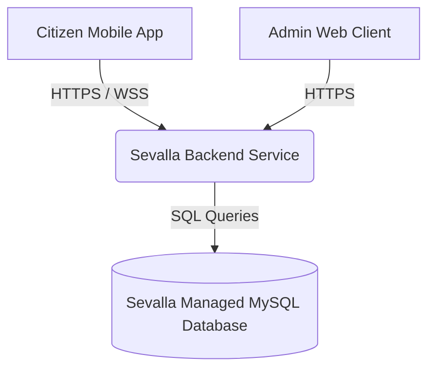

# CitiVoice Deployment Guide for Sevalla

This guide outlines the step-by-step process of deploying the CitiVoice web platform (Backend API + React Admin dashboard) to production using **Sevalla**.

---

## Architecture Overview

---

## Step 1: Set up the Managed MySQL Database

Instead of running MySQL in a Docker container, it is highly recommended to use **Sevalla's Managed Database Hosting** for automated backups, high availability, and scaling.

1. Log in to your **Sevalla Dashboard**.
2. Navigate to **Databases** and click **Create > Database**.
3. Configure the database settings:
   - **Type**: MySQL
   - **Version**: 8.0
   - **Region**: Select a data center closest to your primary user base (e.g., Singapore or US).
4. Once provisioned, copy the connection details from the Sevalla dashboard:
   - Hostname (e.g., `db-xxx.sevalla.com`)
   - Port (e.g., `3306`)
   - Database Name (e.g., `citivoice`)
   - Username (e.g., `root` or a custom user)
   - Password
5. Initialize the database schema:
   - Connect to your database using a local client (like DBeaver or MySQL Workbench) using the connection details.
   - Run the schema script located at [schema.sql](file:///c:/project/citivoice/backend/database/schema.sql) to set up all tables.

---

## Step 2: Deploy the Backend (API & Socket Server)

The backend is deployed as a **Sevalla Application** built using the project's [Dockerfile](file:///c:/project/citivoice/backend/Dockerfile).

1. In the Sevalla Dashboard, click **Create > Application**.
2. Link your Git repository (GitHub, GitLab, or Bitbucket).
3. Configure the build settings:
   - **Subdirectory / Build Context**: `/backend` (This is where the backend code and Dockerfile live).
   - **Build Method**: Dockerfile.
   - **Start Command**: Let Sevalla auto-detect the CMD from the Dockerfile (`npm start`).
4. Set up the **Environment Variables** in the Application's settings:

| Variable | Description / Recommended Value |
| --- | --- |
| `NODE_ENV` | `production` |
| `PORT` | `5000` (or let Sevalla automatically bind to a dynamic port) |
| `DB_HOST` | Hostname of your Sevalla Managed Database |
| `DB_PORT` | `3306` |
| `DB_USER` | Username of your Sevalla Managed Database |
| `DB_PASSWORD` | Password of your Sevalla Managed Database |
| `DB_NAME` | Database Name of your Sevalla Managed Database |
| `JWT_SECRET` | Generate a strong secret: `node -e "console.log(require('crypto').randomBytes(64).toString('hex'))"` |
| `ALLOWED_ORIGINS` | Comma-separated list of allowed origins (e.g., `https://admin.yourdomain.com`) |
| `BASE_URL` | The public URL assigned to your backend app by Sevalla |
| `GROQ_API_KEY` | Your production Groq API Key |
| `GMAIL_USER` | Your email address for notification delivery |
| `GMAIL_APP_PASSWORD` | App Password generated for your email |
| `RATE_LIMIT_MAX` | `100` (production rate limiting count) |

5. Deploy the application. Note down the public URL assigned to it (e.g., `https://citivoice-api.sevallademo.com`).

---

## Step 3: Deploy the React Admin Dashboard

The React frontend is deployed as a **Sevalla Static Site** which is highly performant and cost-effective.

1. In the Sevalla Dashboard, click **Create > Static Site**.
2. Link the same Git repository.
3. Configure build settings:
   - **Base Directory**: `admin-web`
   - **Build Command**: `npm run build`
   - **Publish Directory**: `build`
4. Set the **Environment Variables**:
   - `REACT_APP_API_URL`: Set this to the public URL of your backend + `/api` (e.g., `https://citivoice-api.sevallademo.com/api`).
5. Deploy the Static Site. Copy the public URL assigned to it (e.g., `https://citivoice-admin.sevallademo.com`).

*Note: Remember to go back to the Backend application environment variables and update `ALLOWED_ORIGINS` to include this new admin web URL to allow CORS requests.*

---

## Step 4: Verify Deployment

1. Visit the public Admin Web URL.
2. Sign in with the default admin credentials:
   - **Email**: `admin@citivoice.gov.ph`
   - **Password**: `admin123`
3. Verify that requests load from the dashboard and socket connections connect successfully.
