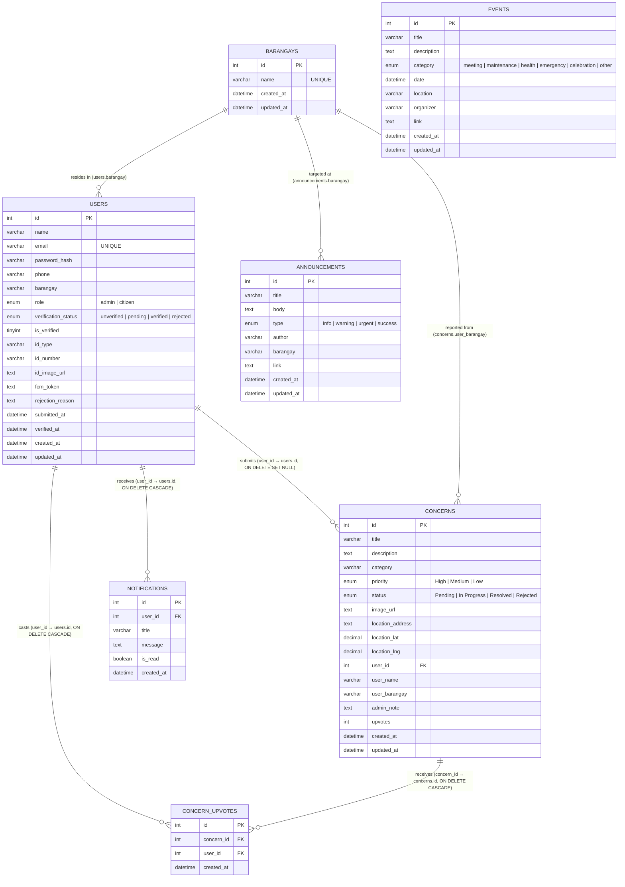
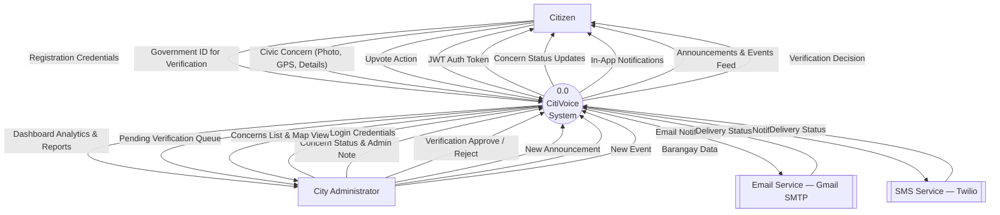
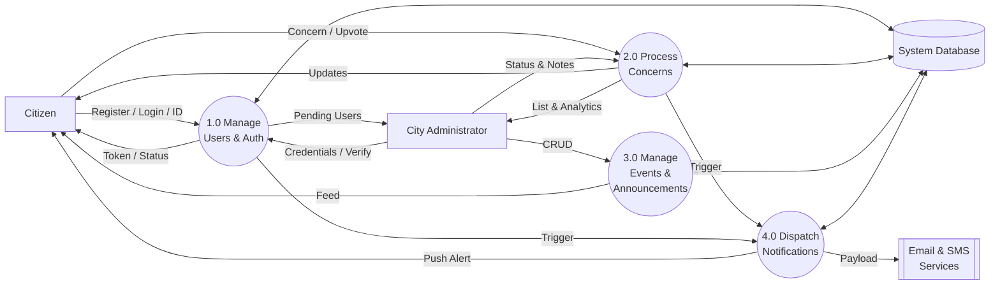
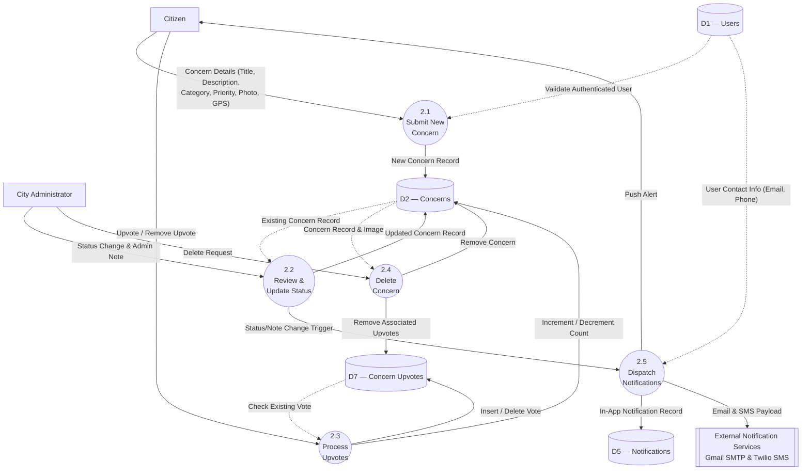
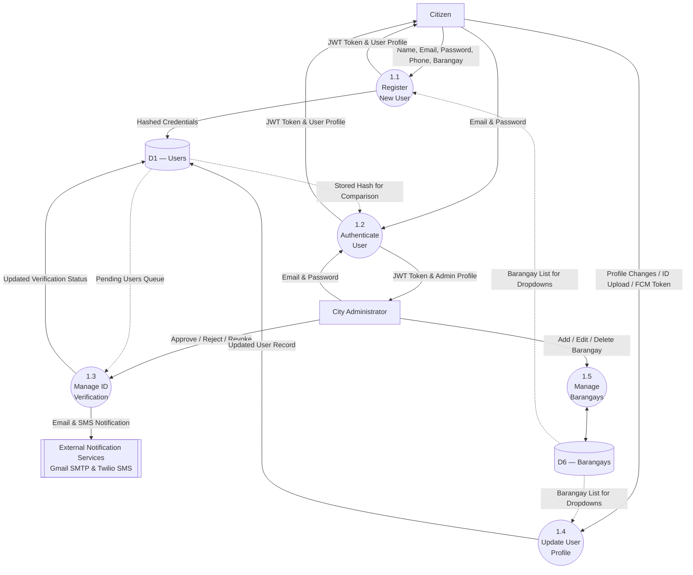
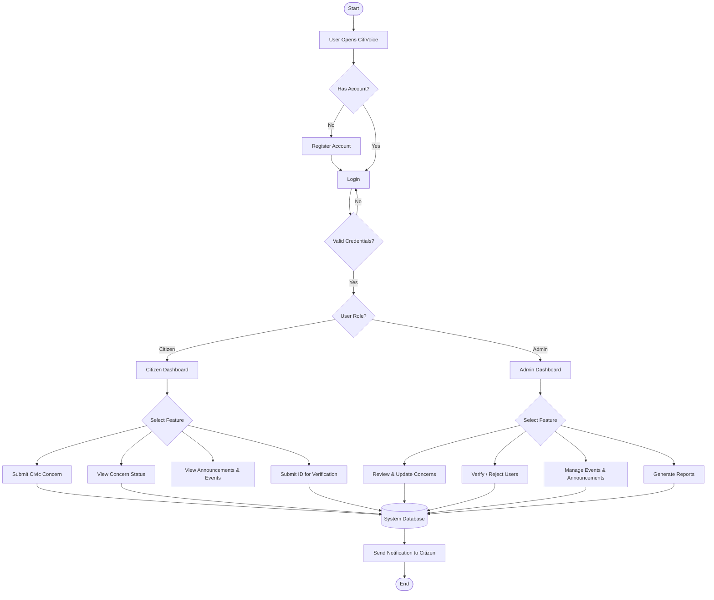
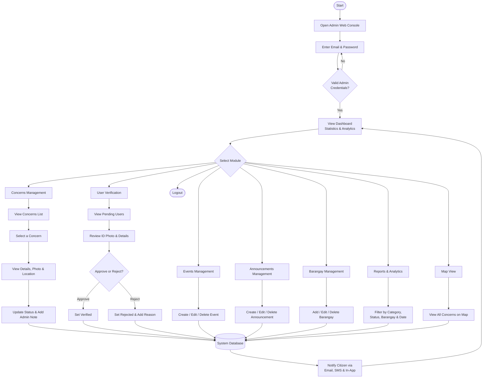
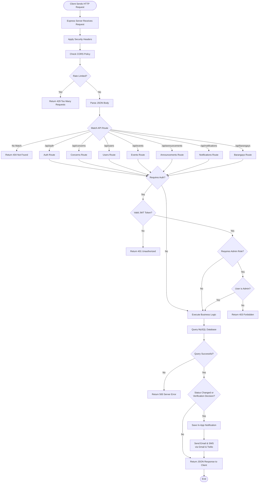

# CitiVoice Diagrams

Here are the Entity Relationship Diagram (ERD) and Data Flow Diagrams (DFD) for the CitiVoice project.

> [!TIP]
> **How to use this in Figma:**
> 1. In Figma, go to **Plugins** and search for **"Mermaid"** (there are several free ones like *Mermaid to Figma* or *Mermaid Chart*).
> 2. Run the plugin and copy-paste the raw Mermaid code block below into it.
> 3. It will automatically draw the diagrams for you inside Figma as editable vectors!

---

## Entity Relationship Diagram (ERD)

This diagram shows the complete database structure derived from the MySQL schema (`schema.sql`) and how the different tables relate to each other.

---

## Data Flow Diagram (DFD) — Level 0 Context Diagram

This diagram shows the external entities and the high-level data flows entering and leaving the CitiVoice system boundary.

---

## Data Flow Diagram (DFD) — Level 1

This diagram decomposes the Level 0 process into sub-processes and introduces the Data Stores.

---

## Data Flow Diagram (DFD) — Level 2 (Process 2.0 — Civic Concerns)

This diagram decomposes **Process 2.0 (Process Civic Concerns)** into its detailed sub-processes showing how concerns are submitted, reviewed, upvoted, and how notifications are triggered.

---

## Data Flow Diagram (DFD) — Level 2 (Process 1.0 — Users & Authentication)

This diagram decomposes **Process 1.0 (Manage Users & Authentication)** into its detailed sub-processes.

---

## System Flowchart

This flowchart illustrates the overall process flow of the CitiVoice system.

---

## System Flowchart — Admin Web Console

This flowchart shows the process flow of the CitiVoice **Admin Web Console**.

---

## Program Flowchart

This flowchart shows the internal execution flow of the CitiVoice application when processing a request.

